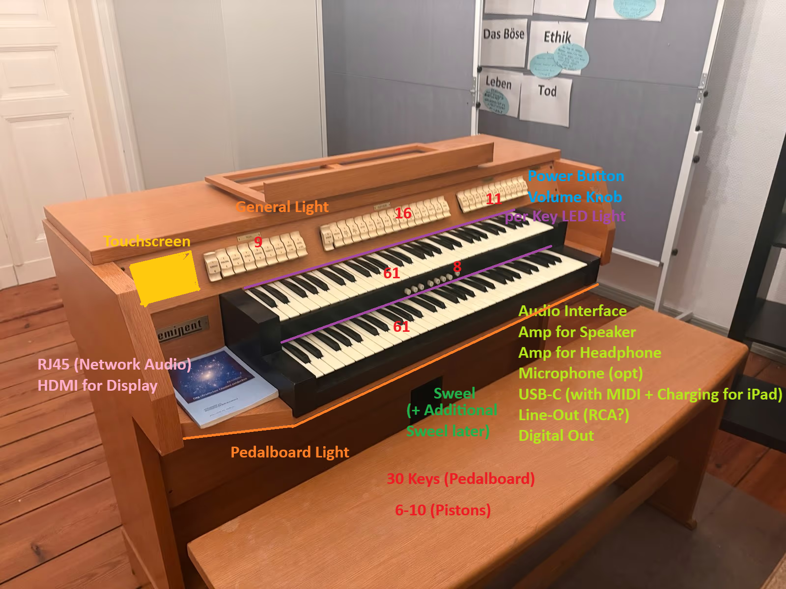

# Joe-Organ

## Software
[GrandOrgue](https://github.com/GrandOrgue/grandorgue)
## Parts
- [Pedalboard Controller](https://github.com/pedalboard/pedalboard-hw)
- Touchscreen

### Buttons
#### Keys
- 2x 61 Keys
- 1x 30 Pedals
  - [Toe Pistons (6-8x)](https://www.openpipes.org/toe-piston/)
- evtl LED Indicator
- [8x8 Keyboard Matrix](https://www.lumissil.com/applications/industrial/appliance/is31io7326)
#### Registration
- 9 Register
- 16 Register
- 11 Register
- evtl LED Indicator

### Others
- [Additional Volume Pedal](https://www.openpipes.org/volume-pedal/)
- https://www.openpipes.org/analog-sliders/
- 